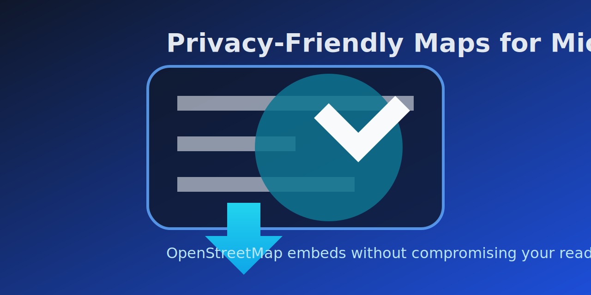

# Privacy-Friendly OSM Maps for Micro.blog



Embed OpenStreetMap views in your Micro.blog posts with optional privacy protection. Readers see a static preview first, then can opt-in to load the interactive map.

## Usage

```markdown


```

### Parameters

- **`loc`** – Coordinates in `latitude,longitude` format (e.g. `48.1351,11.5820`)
- **`zoom`** – Zoom level from 0 (whole world) to 19 (building level), default: 14

### Recommended Zoom Levels

- **10–13** for city/region
- **14–16** for neighborhood/town center (default)
- **17–19** for individual buildings

## Example


Live example: [fischr.org/2017/09/03/oben-links-am-lago-di](https://fischr.org/2017/09/03/oben-links-am-lago-di)

## Testing

Use the [OSM Embed Validator](https://flschr.github.io/mbplugin-osm-embeds/) to try out your settings in the browser.

## Configuration

Install the plugin and configure optional settings under **Design → Edit Plugins**:

- **Geoapify API Key** – For static preview images (optional but recommended)
- **Default Zoom** – Used when no zoom is specified in the shortcode
- **Preview Style** – Map design for light/dark mode
- **Privacy Notice** – Text for optional privacy overlay

### Set Up Static Previews (Optional)

Without an API key, the map embeds directly. With Geoapify you get a clickable preview image:

1. Create free account at [Geoapify](https://www.geoapify.com/) (3000 requests/day free)
2. Generate API key in dashboard
3. Enter key in plugin settings
4. Optional: Choose map style (e.g. `osm-carto`, `dark-matter-yellow-roads`)

## Customization

Explore customization options with these interactive playgrounds:

- **[Pin Playground](https://apidocs.geoapify.com/playground/icon/)** – Design custom map markers
- **[Color & Style Playground](https://www.geoapify.com/static-maps-api/)** – Test different map styles and colors

## Notes

- The plugin uses OpenStreetMap servers. High-traffic sites should consider running their own tile servers.
- RSS feeds will show maps automatically when coordinates are provided.

## Author

Created by **René Fischer**.
